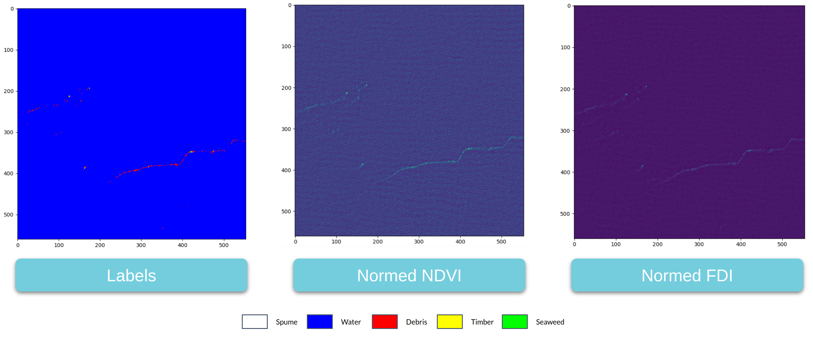

## A plastic detection pipeline for coastal waters

This repo implements a workflow to detect macro-plastics in coastal waters using Sentinel 2 satellite data. 



This project is the result of a collaboration between [Plymouth Marine Labratory](https://www.pml.ac.uk/) and the [Data Clinic](https://dataclinic.twosigma.com/) at [Two Sigma](https://www.twosigma.com/). It implements an extended version of the model described in the paper [Finding Plastic Patches in Coastal Waters using Optical Satellite Data](https://www.nature.com/articles/s41598-020-62298-z) as an [EOLearn](https://github.com/sentinel-hub/eo-learn) pipeline.
 
The model uses Sentinel satellite data from coastal waters to detect floating macro-plastics. The scale of these plastics is much smaller than an individual Sentinel 2 pixel(~10m) so the model makes use of multi-band spectra for detection.
 
The original model required that an atmospheric correction be applied to the Sentinel scenes before plastic detection could occur. In this updated version, we implement a moving average normalization algorithm which does not require atmospheric correction. It also makes the model more robust to variations in background water conditions. For more information, please refer to this [SciPy2020 talk](https://www.youtube.com/watch?v=ylT4J6wCctQ) in which we discuss our approach in detail.
 
 
## Project structure
 
The project is organized into the following submodules:
 
- plasticfinder.tasks: This module contains the various EOLearn tasks that make up the processing pipeline
- plasticfinder.workflows: This module contains definitions of workflows composed of EOLearn tasks
 
In addition to these modules, we defined the following folders for storing the input and output data for the process:
 
- scenes: A set of json files defining scenes on which the plastic prediction is to be carried out
- data: This is where the training data, EOPatches that make up each scene and various results will be generated
- models: A folder that contains the trained models and model performance data
 
## Installing the dependencies
 
This project uses pipenv to manage dependencies, to install them simply run:
 
```bash
pipenv install
pipenv shell
```
 
## SentinelHub
 
In this current iteration of the pipeline, the required Sentinel data is pulled from [SentinalHub](https://www.sentinel-hub.com/).
As such, using the pipeline will require you to set up a SentinelHub account and to activate your credentials.
 
1. Set up a trail account by going [here](https://www.sentinel-hub.com/trial)
2. Find your instance ID on the configuration page for your account
3. Run the following on the command line
 
```
sentinelhub.config --instance_id your_instance_id
sentinelhub.config --show
```
 
You should then be setup.
 
In future iterations of this workflow we hope to enable other sources of Sentinel imagery.
 
## Running the code
 
The workflow is broken into three main tasks
 
1) Training a model
2) Downloading a scene from SentinelHub
3) Using the model to predict classification labels over a given scene
 
## Training a model
 
To train a model, you will need to specify the training data. This is done by creating a file with the following columns:
 
- Lat: The latitude of the target pixel
- Lon: The longitude of the target pixel
- date: The date of the Satellite pass for the pixel
- label: The label for this pixel, one of Water, Debris, Spume, Seaweed or Timber
 
Once that file has been created, you need to run the download_features.py script. This will create an EOPatch for a region around each target pixel with the required data. An example of a feature download run is:
 
```bash
python download_features.py --features data/features.csv
```
 
This will generate EOPatches in a folder called data/training.
 
Once that is done various models can be trained on the labeled data. To do so run:
 
```bash
python train_model.py --method=median --window_size=200 --name median_200_L1C
```
 
This will train the model using a median filter over a normalization window of 200m and save the model as well as its performance metrics in the folder models/median_200_L1C.
 
The results in the SciPy talk were obtained using a median filter and 200m buffer as indicated in the command above.
 
## Downloading a scene
 
Once we have a trained model, the next step is to use it to detect plastics in a new scene. To stop us from burning through SentinelHub credits, we have a preprocessing script that will divide the area you are interested in examining into smaller subregions, download each subregion from SentinelHub, and apply the processing workflow to add all the required features to the EOPatch.
 
To specify the region we are interested in running the analysis over, we define a scene file. This is just a small JSON file with the following format:
 
```json
{
   "minLon" : -0.301972,
   "maxLon" : 0.69866,
   "minLat" : 5.3241,
   "maxLat" : 6.33057,
   "timeRange": ["2018-10-30","2018-11-01"],
   "outputDir" : "data/Ghana/"
}
```
 
This defines the region in space, the time range over which we wish to look for plastics, and an output directory to hold the EOPatches.
 
Then we can simply run the following script:
 
```bash
python download_scene.py --scene=scenes/Gulf.json
```
 
This will take a while but when it is done you should have a cached version of all the data we will need as a series of EOPatches. These patches contain the following data:
 
- FDI - the floating debris index
- NDVI - the NDVI index
- NDWI - the water index
- NORM_FDI - the locally normalized FDI
- NORM_NDVI - the locally normalized NDVI
- WATER_MASK - masked region of water using the NDWI cutoff
- DATA_MASK - the masked region of the image where there is valid data
- CLOUD_MASK - the cloud mask for the scene
- L1C Bands - the Sentinel 2 L1C bands
- L2A Bands - the Sentinel 2 L2A bands
 
each EOPatch directory will also contain plots of these quantities.
 
## Making predictions on a scene
 
Once we have a scene downloaded we can run a prediction on that scene:
 
```bash
python predict_scene.py --scene=scene/Gulf.scene --model=models/median_200_L1C --method=median -window=200
```
 
This will apply the plastic detection model and add the "CLASSIFICATION" data layer to the EOPatches. It will also produce a results.png for each of the patches showing the predicted labels.
 
